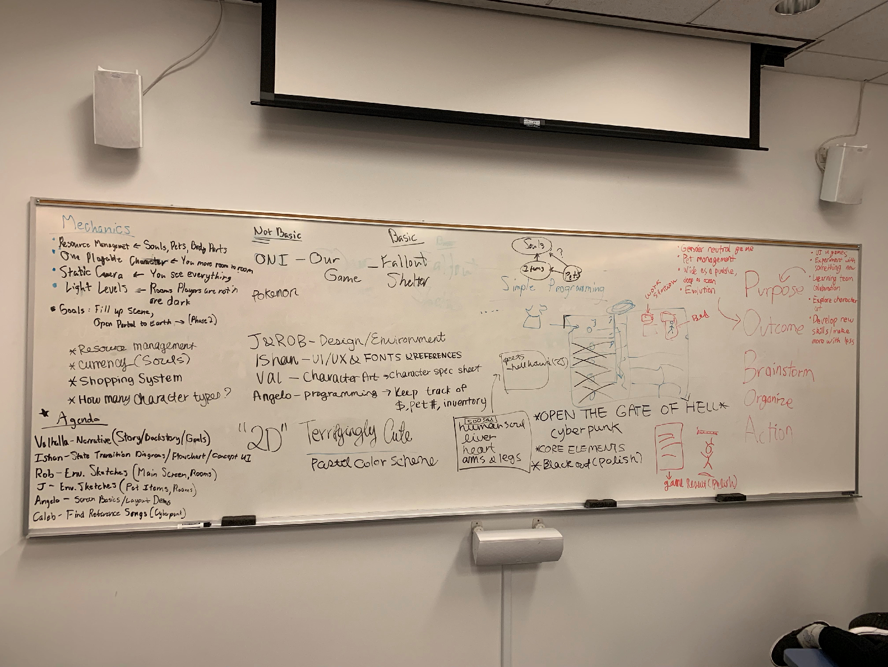

# DOMESTICATE HELL: DESIGN PROCESS JOURNAL 

This design process journal serves as a record of the development process of the game. 

*Domesticate Hell* is created as a part of Columbia College Chiago's '19-'20 indie game development capstone project. 

Team Members: J (Cattatonicat), Val, Ishan, Rob, Caleb, and Angelo. 

## Week 1 Journal Entry

During the first week of development, our team spent time brainstorming and making sure we are all on the same page regarding what kind of game *Domesticate Hell* will be. Spending some time discussing in person has helped us figure out our team dynamics and suitable roles for each member of the team. 

We decided on a 2 dimenstional sideview game, and chose our primary references: Oxygen Not Included & Fallout Shelter. 

**Angelo** will be taking care of programming 
**Caleb** will be taking care of sound and music
**Valhalla** will be taking care of character development 
**Rob** Will be taking care of environmental art 
**Ishan** Will be taking care of UI/UX
and last but not least, **J** (myself) will be taking care of game design and documentation alongside portion of art assets

## Week 2 Journal Entry

Our team decided on 4 different types of habitats (Fire / Shadow / Electricity / Alchemy) for corresponding 4 types of pets. 
Among the four habitats, the Fire habitat is the cheapest and the Alchemy habitat is the most expensive.
When the game begins, players should be able to purchase the Fire habitat with their starting funds. 
Once players purchase a fire pet to place in the fire habitat, which should also be affordable with their starting funds, they will be able to accumulate more wealth in the forms of souls and gold. 
Now that the players are able to generate some savings, they can look forward to purchasing the following habitats, in the order of least expensive to the most expensive: Shadow, Electricity, Alchemy. 

At this phase, Angelo, the programmer of the team is working on an inventory and player interaction script to enable shop feature in the game, with is imperative in activing in-game economy. 

Valhalla, character designer, has written an outline of the backstory of the player, and 4 different types of pets: Golem Tiger (Fire), Shadow Wolf (Shadow), Lightning Bun (Electricity), Magic Fish (Alchemy). 

Rob, environment artist, is working on illustrating the 4 habitats as well as the background that will be laid beneath the habitat sprites. 

